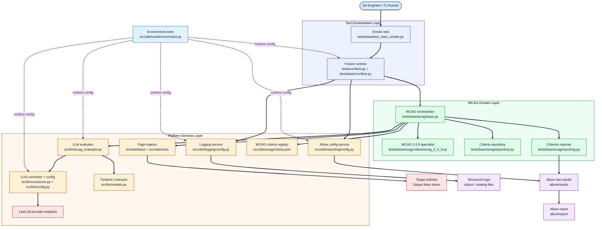
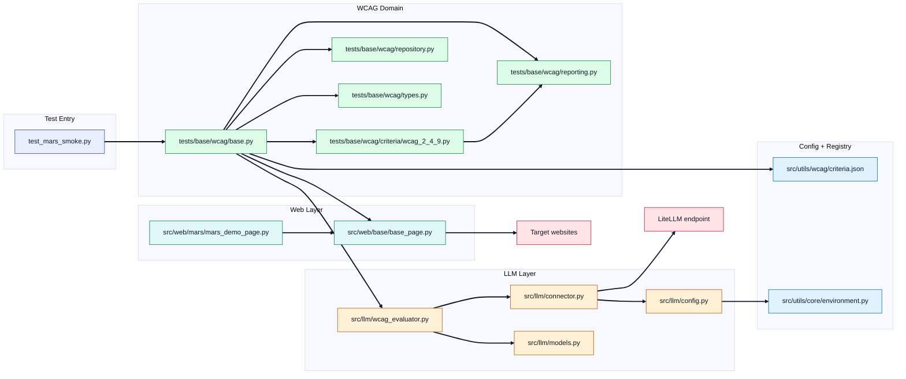
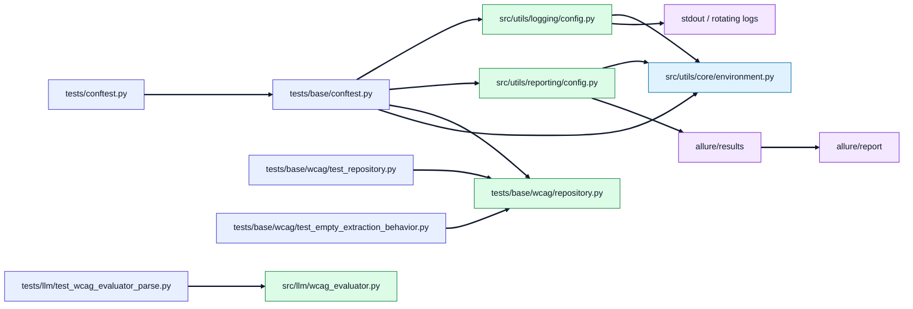
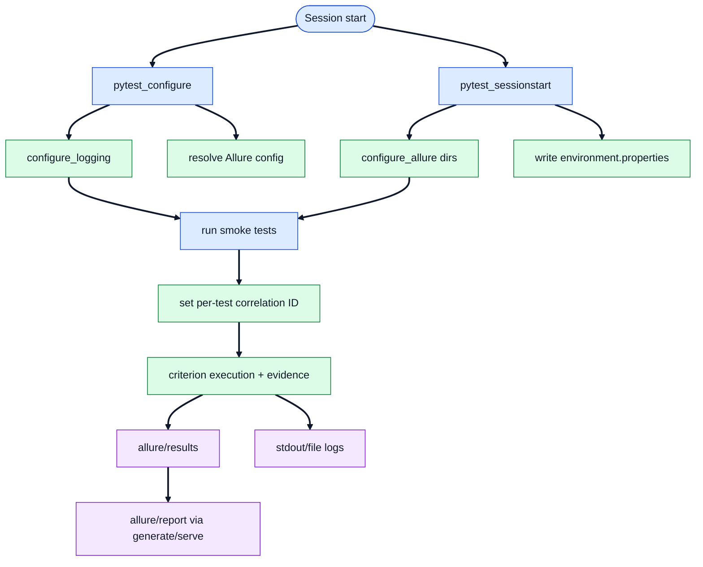

# Architecture

This document is the single source of truth for the architecture of
`a11y-auditor`. It describes the system in layers, components, runtime
sequence, data contracts, and lifecycle, with diagrams that map directly to the
code in [`src/`](../src) and [`tests/`](../tests).

> Management-facing diagrams (process and tooling overview, one-slide view) live
> in [MANAGEMENT_DOKUMENTATION.md](MANAGEMENT_DOKUMENTATION.md). The narrative
> technical reference lives in
> [TECHNICAL_DOCUMENTATION.md](TECHNICAL_DOCUMENTATION.md).

## System context

`a11y-auditor` is an asynchronous accessibility smoke-testing framework. A
Playwright-driven page object opens a target page; CSS/XPath selectors and
JavaScript extractors (declared in
[`src/utils/wcag/criteria.json`](../src/utils/wcag/criteria.json)) pull the DOM
evidence relevant to each WCAG criterion; an LLM (reached through LiteLLM)
evaluates each element against the criterion; results are validated by strict
Pydantic schemas and attached to Allure as auditable evidence. Non-accepted
statuses fail the smoke test with an aggregated, per-element summary.

## Design principles

- **Layered separation.** Test orchestration, WCAG domain logic, and platform
  services (web, LLM, logging, reporting) are independent and depend inward.
- **Configuration over code.** Criteria, prompts, selectors, and runtime
  behavior are data (`criteria.json`, environment variables), not code changes.
- **Strict contracts.** Every model boundary is a typed Pydantic schema;
  malformed model output is rejected and retried, never silently trusted.
- **Auditability by default.** Every test and element result is traceable
  through correlation IDs (logs) and Allure attachments (evidence).

## Component responsibilities

| Component | Path | Responsibility |
| --- | --- | --- |
| Smoke test | `tests/base/test_mars_smoke.py` | Entry point; drives a page and invokes the WCAG run. |
| Fixture runtime | `tests/conftest.py`, `tests/base/conftest.py` | Session-scoped Playwright/browser, logging, Allure, criteria loading. |
| WCAG orchestrator | `tests/base/wcag/base.py` | Extract → evaluate → report → aggregate failures across criteria. |
| WCAG 2.4.9 specialist | `tests/base/wcag/criteria/wcag_2_4_9.py` | Destination-page enrichment for link-purpose (link-only) evaluation. |
| Criterion reporter | `tests/base/wcag/reporting.py` | Per-element Allure evidence and the shared pass/fail assertion. |
| Criteria repository | `tests/base/wcag/repository.py` | Resolve and load `criteria.json`. |
| Data contracts | `tests/base/wcag/types.py` | Typed criterion registry and failure records. |
| Page objects | `src/web/base`, `src/web/mars` | Navigation and DOM extraction primitives. |
| LLM evaluator | `src/llm/wcag_evaluator.py` | Chunking, prompt assembly, parsing, validation, reconciliation. |
| LLM connector | `src/llm/connector.py`, `src/llm/config.py` | Async LiteLLM calls with retry; environment-backed config. |
| LLM schemas | `src/llm/models.py` | Pydantic request/response contracts. |
| Environment store | `src/utils/core/environment.py` | Single typed source for environment variables. |
| Logging service | `src/utils/logging/config.py` | Structured logging with correlation IDs and rotation. |
| Reporting service | `src/utils/reporting/config.py` | Allure directory/config lifecycle. |
| Criteria registry | `src/utils/wcag/criteria.json` | Selectors, JS extractors, and prompts per WCAG criterion. |

## 1. End-to-End Architecture (Layered)



Legend:

- Node color indicates responsibility: blue = test orchestration, green = WCAG
  domain logic, orange = platform services, rose = external services, violet =
  produced artifacts, light-blue = configuration.
- Solid arrows are primary control or data flow.
- Dotted arrows from the environment store are runtime configuration injection.
- Layers progress from test trigger to domain orchestration to platform
  integrations.

## 2. Repository Component Architecture

### 2.1 Core Execution Components



Legend:

- Test nodes are entry points; WCAG nodes are orchestration and rule logic; Web
  nodes are browser-facing page abstractions.
- LLM nodes perform prompt creation, model I/O, and response normalization.
- Config nodes provide the static registry and runtime settings.
- External nodes are systems outside the repository boundary.

### 2.2 Runtime Infrastructure and Quality Components



Legend:

- Test components initialize the runtime and verify core behavior offline.
- Infrastructure components provide logging, reporting, repository, and
  evaluator services.
- Artifact nodes are generated outputs during and after execution.
- Arrow direction reflects initialization and output-production order.

## 3. Runtime Sequence Architecture

```mermaid
%%{init: {'theme':'base','themeVariables':{'lineColor':'#0F172A','fontSize':'15px'},'themeCSS':'.messageLine0,.messageLine1{stroke:#0F172A;stroke-width:2.4px;} .messageText{fill:#0F172A;font-weight:500;} .actor-line{stroke:#334155;stroke-width:1.5px;} .loopLine{stroke:#0F172A;stroke-width:1.8px;} .labelBox{stroke:#0F172A;stroke-width:1.4px;}'}}%%
sequenceDiagram
    autonumber
    participant PT as Pytest runner
    participant FX as Fixture runtime
    participant ST as Smoke test case
    participant PO as Page object layer
    participant WB as WCAG base orchestrator
    participant W249 as WCAG 2.4.9 specialist
    participant EV as WCAG evaluator
    participant CN as LLM connector
    participant LM as LiteLLM endpoint
    participant RP as Allure reporter

    Note over PT,RP: Solid arrows = call path; Dashed arrows = returned payload; loop = repeated per criterion; alt = optional 2.4.9 branch

    rect rgb(233, 242, 255)
        PT->>FX: pytest_configure + pytest_sessionstart
        FX->>FX: configure logging, allure, browser context
    end

    rect rgb(234, 251, 243)
        PT->>ST: run async smoke test
        ST->>PO: open/navigate page
        ST->>WB: run_configured_wcag_criteria(...)
    end

    loop per criterion (2.4.4, 3.1.1, 3.1.2)
        WB->>PO: extract elements (selectors + js_extractor)
        WB->>EV: evaluate(request)
        EV->>CN: generate_completion(...)
        CN->>LM: litellm.acompletion(...)
        LM-->>CN: model output
        CN-->>EV: response envelope
        EV->>EV: parse + schema validate + reconcile
        EV-->>WB: WCAGEvaluationResult
        WB->>RP: attach evidence + criterion result
    end

    alt include_criterion_2_4_9 = true
        WB->>W249: run_criterion_2_4_9(...)
        W249->>PO: extract source links
        W249->>W249: open destination pages + enrich data
        W249->>EV: evaluate(chunk_size=5)
        EV->>CN: generate_completion(...)
        CN->>LM: litellm.acompletion(...)
        LM-->>CN: model output
        CN-->>EV: response envelope
        EV-->>W249: WCAGEvaluationResult
        W249->>RP: attach skipped links + results
    end

    WB->>WB: aggregate failures across criteria
    WB-->>ST: pass/fail summary
```

Legend:

- Blue and green rectangles group the startup and execution phases.
- `PT`, `FX`, and `ST` are test orchestration; `WB`, `W249`, `EV`, and `CN` are
  the domain + LLM evaluation path.
- Dashed return arrows (`-->>`) are response payloads from lower layers.
- The `alt` block runs only when criterion 2.4.9 is enabled (opt-in per flow).

## 4. Data and Contract Architecture

```mermaid
%%{init: {'theme':'base','themeVariables':{'lineColor':'#0F172A','fontSize':'15px'},'themeCSS':'.edgePath .path{stroke:#0F172A;stroke-width:2.4px;} .flowchart-link{stroke:#0F172A;stroke-width:2.4px;} .label text{fill:#0F172A;font-weight:500;}'}}%%
flowchart LR
    classDef src fill:#DFF7F6,stroke:#0F766E,color:#111827;
    classDef model fill:#FFF1D6,stroke:#B45309,color:#111827;
    classDef proc fill:#DCFCE7,stroke:#15803D,color:#111827;
    classDef out fill:#F3E8FF,stroke:#7E22CE,color:#111827;

    A[criteria.json\nselectors + js_extractor + prompt]
    B[DOM extraction payload\nper locator]
    C[ExtractedElement]
    D[WCAGEvaluationRequest\nrule_id + elements]
    E[Prompt messages\nsystem + user + schema]
    F[LiteLLM raw response]
    G[Normalized JSON payload]
    H[WCAGEvaluationResult\nstatus + results]
    I[ElementEvaluationFailure list]
    J[Allure attachments\nraw response, per element, summary]

    A --> B --> C --> D --> E --> F --> G --> H --> I --> J

    linkStyle default stroke:#0F172A,stroke-width:2.4px

    class A,B src;
    class C,D,H,I model;
    class E,F,G proc;
    class J out;
```



Legend:

- `src` nodes are input sources from repository config and browser extraction.
- `model` nodes are typed contracts used by evaluation and reporting logic.
- `proc` nodes are transformation steps from prompt generation to LLM
  normalization.
- `out` node captures the final evidence attached to reports.

## 5. Test, Logging, and Reporting Lifecycle



Legend:

- Phase nodes are chronological checkpoints in the test lifecycle.
- Service nodes are functions that configure or execute behavior.
- Artifact nodes are generated outputs consumed by developers and CI.
- Top-to-bottom flow shows how setup decisions propagate to reporting artifacts.

## 6. Key architecture notes

- The architectural center of gravity is
  [`tests/base/wcag/base.py`](../tests/base/wcag/base.py): it coordinates
  extraction, evaluation, reporting, and failure aggregation, and fails once
  with an aggregated summary rather than aborting on the first criterion.
- [`tests/base/wcag/criteria/wcag_2_4_9.py`](../tests/base/wcag/criteria/wcag_2_4_9.py)
  is the one specialization path: it opens link destinations and enriches each
  element before evaluation. It is enabled per suite via the
  `include_criterion_2_4_9` flag.
- [`src/llm/wcag_evaluator.py`](../src/llm/wcag_evaluator.py) enforces
  schema-driven, chunked evaluation and reconciles model output (missing,
  extra, or duplicate element IDs) so a partial model response cannot silently
  drop coverage.
- The shared pass/fail gate lives in `assert_llm_outcome_or_raise`
  ([`tests/base/wcag/reporting.py`](../tests/base/wcag/reporting.py)) and is
  reused by both the standard orchestrator and the 2.4.9 specialist.
- Runtime infrastructure is centralized in [`src/utils`](../src/utils)
  (`environment`, `logging`, `reporting`) and consumed by both fixtures and the
  LLM/configuration layers.
- External dependencies are modeled as services/endpoints (LiteLLM provider,
  target websites), not as databases — the framework holds no persistent state
  of its own beyond generated artifacts.
- [`src/web/base/base_page.py`](../src/web/base/base_page.py)`.run_axe_audit`
  is currently a placeholder that returns `{}`; the Allure attachment pipeline
  is wired so a real Axe-core integration can drop in without changing callers.
