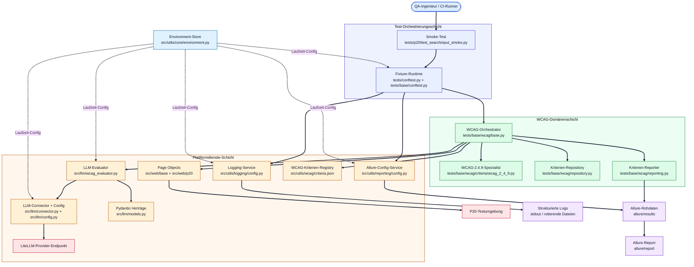
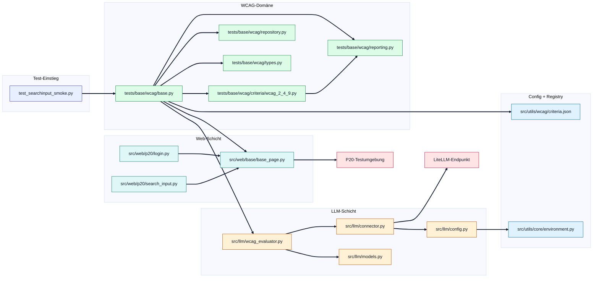
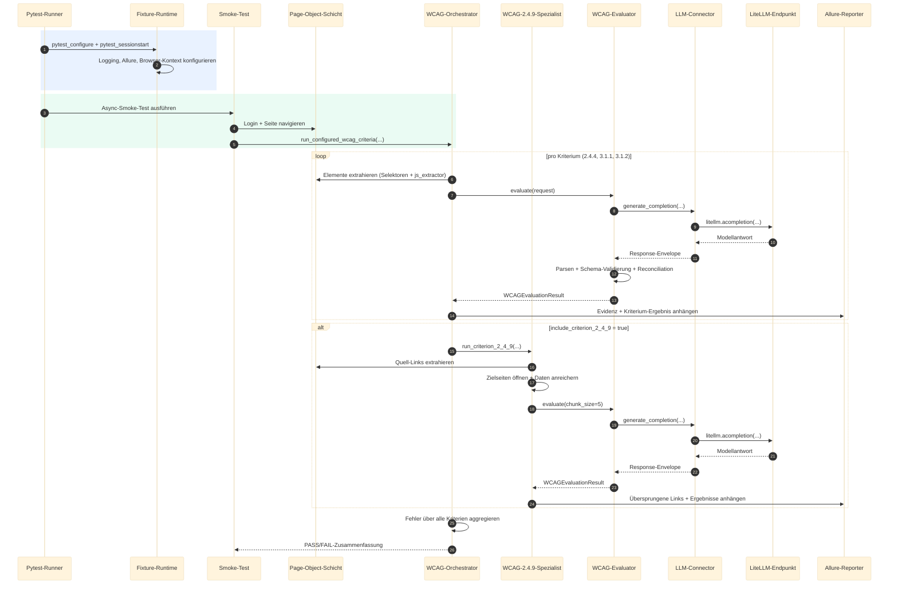
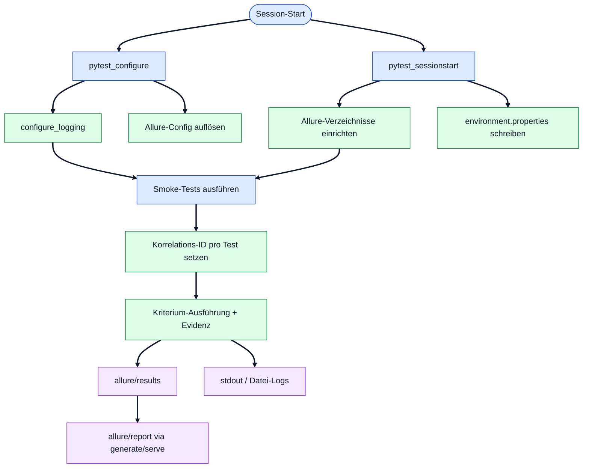

# Entwicklerhandbuch — a11y-llm

**Zielgruppe:** Entwickler, die das Framework verstehen, betreiben oder erweitern wollen.

Dieses Handbuch deckt Architektur, Code-Struktur, Konfigurationsreferenz,
Erweiterungsmuster und Qualitätssicherung vollständig ab.

---

## Inhaltsverzeichnis

1. [Systemüberblick](#1-systemüberblick)
2. [Repository-Struktur](#2-repository-struktur)
3. [Laufzeitanforderungen und Abhängigkeiten](#3-laufzeitanforderungen-und-abhängigkeiten)
4. [Architektur](#4-architektur)
5. [Komponenten-Referenz](#5-komponenten-referenz)
6. [WCAG-Kriterien-Konfiguration](#6-wcag-kriterien-konfiguration)
7. [Ausführungsmodell](#7-ausführungsmodell)
8. [Fehlerresilienz](#8-fehlerresilienz)
9. [Sicherheit und Datenschutz](#9-sicherheit-und-datenschutz)
10. [Qualitätssicherung](#10-qualitätssicherung)
11. [Das Framework erweitern](#11-das-framework-erweitern)
12. [Bekannte Einschränkungen](#12-bekannte-einschränkungen)
13. [Roadmap](#13-roadmap)

---

## 1. Systemüberblick

`a11y-llm` ist ein asynchrones Barrierefreiheits-Smoke-Test-Framework.

**Ablauf auf einen Blick:**

1. Ein Page-Object öffnet die Zielseite (P20) im Playwright-Browser.
2. CSS/XPath-Selektoren und JavaScript-Extraktoren (konfiguriert in
   `src/utils/wcag/criteria.json`) ziehen die für jedes Kriterium relevante
   DOM-Evidenz.
3. Ein LLM (via LiteLLM) bewertet jedes Element gegen das Kriterium.
4. Die Modellantwort wird gegen strikte Pydantic-Schemata validiert.
5. Ergebnisse werden als auditierbare Evidenz an Allure angehängt.
6. Nicht akzeptierte Status lassen den Smoke-Test mit einer aggregierten
   Zusammenfassung fehlschlagen.

**Designprinzipien:**

- **Schichttrennung** — Test-Orchestrierung, WCAG-Domänenlogik und
  Plattformdienste (Web, LLM, Logging, Reporting) sind unabhängig und
  zeigen nach innen.
- **Konfiguration statt Code** — Kriterien, Prompts, Selektoren und
  Laufzeitverhalten sind Daten (`criteria.json`, Umgebungsvariablen),
  keine Codeänderungen.
- **Strikte Verträge** — Jede Modellgrenze ist ein typisiertes Pydantic-Schema;
  fehlerhafte Modellausgaben werden abgelehnt und erneut angefragt, nie
  stillschweigend akzeptiert.
- **Auditierbarkeit by default** — Jedes Test- und Elementergebnis ist
  über Korrelations-IDs (Logs) und Allure-Attachments (Evidenz) nachvollziehbar.

---

## 2. Repository-Struktur

```text
src/
  llm/            LLM-Konfiguration, Connector, Pydantic-Schemata, Evaluator
  utils/
    core/         EnvironmentStore (typisierter Umgebungsvariablenzugriff)
    logging/      Strukturiertes Logging mit Korrelations-IDs
    reporting/    Allure-Konfigurationslebenszyklus
    wcag/         criteria.json (Selektoren + JS-Extraktoren + Prompts)
  web/
    base/         BasePage (Navigation + DOM-Extraktion)
    p20/          P20-spezifische Page Objects (Login, Sucheingabe)
tests/
  conftest.py     Re-exportiert Base-Fixtures für alle Suites
  base/
    conftest.py   Session-Playwright/Browser, Logging, Allure-Fixtures
    wcag/         Orchestrator, Reporter, Repository, Types, Unit-Tests
      criteria/   Kriterienspezifische Runner (2.4.9-Anreicherung)
  llm/            Evaluator-Parsing-Unit-Tests
  p20/            P20-Smoke-Test-Suite
documentation/    Diese Dokumentation
```

---

## 3. Laufzeitanforderungen und Abhängigkeiten

- Python `>=3.12,<3.14` (begrenzt durch LiteLLMs unterstützten Bereich)
- [Poetry](https://python-poetry.org/) für Abhängigkeitsverwaltung
- Playwright-Browser-Binaries (Chromium): `poetry run playwright install chromium`
- Allure CLI (für lokale Report-Generierung)

**Runtime-Abhängigkeiten:**
`pytest`, `pytest-asyncio`, `allure-pytest`, `litellm`, `pydantic`,
`pydantic-settings`, `tenacity`, `concurrent-log-handler`, `pytest-playwright-axe`

**Entwicklungsabhängigkeiten:**
`ruff`, `mypy`, `pre-commit`, `pip-audit`

---

## 4. Architektur

### 4.1 End-to-End-Architektur (Schichtenmodell)



**Legende:**
- Blau = Test-Orchestrierung · Grün = WCAG-Domänenlogik · Orange = Plattformdienste
- Rosa = externe Dienste · Violett = erzeugte Artefakte · Hellblau = Konfiguration
- Durchgezogene Pfeile = Kontroll-/Datenfluss · Gestrichelt = Laufzeit-Konfigurationsinjektion

---

### 4.2 Kern-Ausführungskomponenten



---

### 4.3 Laufzeit-Sequenz



---

### 4.4 Daten- und Vertragsarchitektur

```mermaid
%%{init: {'theme':'base','themeVariables':{'lineColor':'#0F172A','fontSize':'15px'},'themeCSS':'.edgePath .path{stroke:#0F172A;stroke-width:2.4px;} .flowchart-link{stroke:#0F172A;stroke-width:2.4px;} .label text{fill:#0F172A;font-weight:500;}'}}%%
flowchart LR
    classDef src fill:#DFF7F6,stroke:#0F766E,color:#111827;
    classDef model fill:#FFF1D6,stroke:#B45309,color:#111827;
    classDef proc fill:#DCFCE7,stroke:#15803D,color:#111827;
    classDef out fill:#F3E8FF,stroke:#7E22CE,color:#111827;

    A["criteria.json\nSelektoren + js_extractor + Prompt"]
    B["DOM-Extraktion\npro Locator"]
    C["ExtractedElement"]
    D["WCAGEvaluationRequest\nrule_id + elements"]
    E["Prompt-Nachrichten\nsystem + user + schema"]
    F["LiteLLM-Rohantwort"]
    G["Normalisierte JSON-Nutzlast"]
    H["WCAGEvaluationResult\nstatus + results"]
    I["ElementEvaluationFailure-Liste"]
    J["Allure-Attachments\nRohantwort, pro Element, Zusammenfassung"]

    A --> B --> C --> D --> E --> F --> G --> H --> I --> J

    linkStyle default stroke:#0F172A,stroke-width:2.4px

    class A,B src;
    class C,D,H,I model;
    class E,F,G proc;
    class J out;
```



---

### 4.5 Test-, Logging- und Reporting-Lebenszyklus



---

## 5. Komponenten-Referenz

### 5.1 Environment-Store — `src/utils/core/environment.py`

Einmaliger `EnvironmentStore` (Unterklasse von `pydantic_settings.BaseSettings`),
beim Import geladen und über `get_environment_store()` zugänglich. Bietet
typisierte Accessor-Methoden: `get_required`, `get_optional`, `get_bool_*`,
`get_int_*`, sowie Pfad-Helfer (`resolve_path`, `get_runtime_root`).

Unbekannte Variablen werden ignoriert (`extra="ignore"`); nicht deklarierte
Variablen fallen auf `os.getenv` zurück.

---

### 5.2 Logging — `src/utils/logging/config.py`

Prozessweites Logging, idempotent über einen `LoggingConfigurator`-Singleton
konfiguriert.

- **Formate:** `JsonFormatter` (Zeitstempel, Level, Logger, Nachricht,
  Korrelations-ID, Modul, Funktion, Zeile, Service) und `SafeTextFormatter`
  (escapet `\r`/`\n` gegen Log-Injection).
- **Sinks:** `stdout`, rotierende `file`-Ausgabe (via `concurrent-log-handler`)
  oder `both`. Handler werden getaggt, um Mehrfachregistrierung zu verhindern.
- **Korrelations-IDs:** via `contextvars`-Variable und benutzerdefinierter
  `LogRecord`-Factory; Tests binden die pytest-`nodeid` als Korrelations-ID.

**Öffentliche API:** `configure_logging`, `get_logger`, `set_correlation_id`,
`get_correlation_id`, `clear_correlation_id`

---

### 5.3 Reporting — `src/utils/reporting/config.py`

`AllureConfig` (unveränderlich) plus `AllureConfigurator` für die Vorbereitung
der Results- und Report-Verzeichnisse.

**Öffentliche API:** `load_allure_config_from_environment`, `configure_allure`
(async), `write_environment_properties` (async). Report-Rendering erfolgt mit
dem Allure-CLI; das Paket bereitet nur Verzeichnisse und Umgebungsmetadaten vor.

---

### 5.4 LLM-Schicht — `src/llm/`

- **`config.py`** — `LLMConfig` (gefrorenes Dataclass) und `LLMConfigLoader`,
  der `AUDITOR_LLM_*`-Variablen aus dem Environment-Store liest.
- **`connector.py`** — `Connector` kapselt `litellm.acompletion`. Wiederholt
  mit `tenacity` (3 Versuche, exponentielles Backoff 2–10 s). Feste
  Generierungseinstellungen: `max_tokens=4096`, `timeout=900`,
  `temperature=0.2`, `seed=200994`, `num_ctx=131072`. Das `CompletionClient`-
  `Protocol` hält den Evaluator transport-agnostisch.
- **`models.py`** — strikte Pydantic-Verträge: `ExtractedElement`,
  `WCAGEvaluationRequest`, `ElementEvaluationResult`
  (`PASS`/`FAIL`/`NEEDS_CONTEXT`/`MANUAL_REVIEW`), `WCAGEvaluationResult`
  (`SUCCESS`/`ERROR` + results).
- **`wcag_evaluator.py`** — `WCAGEvaluator` orchestriert die Bewertung:
  1. Elemente in Chunks aufteilen (`chunk_size`, Standard 15).
  2. Prompt-Nachrichten mit JSON-Schema-Verstärkung zusammenstellen.
  3. Connector aufrufen und Antwort validieren (bis zu 3 Validierungsversuche).
  4. Verschiedene Ausgabeformen des Modells normalisieren (Objekt, Array,
     einzelnes Ergebnis, umzäuntes/eingebettetes JSON, typisierte Textchunks).
  5. Abdeckung reconcilieren: Fehlende Element-IDs werden mit `MANUAL_REVIEW`
     befüllt und der Batch-Status auf `ERROR` gesetzt.

---

### 5.5 Web-Schicht — `src/web/`

- **`base/base_page.py`** — `BasePage`: `navigate`, `wait_for_page_load`,
  `extract_elements_by_locator`, `extract_element_data` (führt JS-Extraktoren
  auf einem Locator aus), `run_axe_audit` (Platzhalter, gibt `{}` zurück).
- **`p20/login.py`** — `LoginPage` für den P20-Login-Flow.
- **`p20/search_input.py`** — `SearchInput` als semantisches Zielobjekt nach
  dem Login.

Neue Zielseiten werden als eigene Unterpackages unter `src/web/` ergänzt
und erben von `BasePage` (siehe [Abschnitt 11](#11-das-framework-erweitern)).

---

### 5.6 WCAG-Domäne — `tests/base/wcag/`

- **`repository.py`** — löst `criteria.json` auf und lädt es (expliziter
  Root → `PROJECT_ROOT` → `PROJECT_ROOT_DIR`).
- **`types.py`** — `EmptyBehavior`, `CriterionExecutionConfig`,
  `CriterionFailure`, `CriterionDefinition`, `ElementEvaluationFailure`.
- **`reporting.py`** — `WCAGCriterionAllureReporter` hängt pro-Element-Evidenz
  an; `assert_llm_outcome_or_raise` ist das gemeinsame PASS/FAIL-Gate aller
  Kriterium-Runner.
- **`base.py`** — der Orchestrator: Extraktion, Bewertung, Reporting, typisierte
  Kriterium-Registry (`criterion_steps`) und `run_configured_wcag_criteria`,
  das alle Kriterien ausführt, Auslassungen und Fehler sammelt und einmalig
  mit einer aggregierten Zusammenfassung fehlschlägt.
- **`criteria/wcag_2_4_9.py`** — der 2.4.9-Spezialist: löst Link-Ziele auf,
  öffnet jede eindeutige Zielseite einmalig (gecacht), reichert jedes Element
  mit Zielmetadaten an und evaluiert mit `chunk_size=5`.

---

## 6. WCAG-Kriterien-Konfiguration

Kriterien sind als Daten in `src/utils/wcag/criteria.json` deklariert.
Jeder Eintrag enthält: `name`, `description`, `url`, `level`,
`selectors` (Liste), `js_extractor` (JS-Funktionsstring, der pro Element ein
Datenobjekt zurückgibt) und `prompt`.

| Kriterium | Name | Stufe | Leer-Extraktions-Policy |
| --- | --- | --- | --- |
| 2.4.4 | Linkzweck (im Kontext) | A | überspringen |
| 2.4.9 | Linkzweck (nur Link) | AAA | bespoke (Spezialist-Pfad) |
| 3.1.1 | Sprache der Seite | A | fehlschlagen |
| 3.1.2 | Sprache von Teilen | AA | bestehen |

Für 2.4.9 behandelt der Spezialist-Runner Leere selbst: keine Kandidaten-Links
= bestehen mit Evidenz-Notiz; alle Links ohne auflösbare Zielseite = Fehler.

Der P20-Smoke-Test führt alle vier Kriterien aus (2.4.9 via `include_criterion_2_4_9=True`).

---

## 7. Ausführungsmodell

- Tests sind asynchron (`asyncio_mode = "auto"`). Playwright-Runtime, Browser,
  Kontext und Page-Fixtures sind session-scoped und in `tests/base/conftest.py`
  definiert; `tests/conftest.py` re-exportiert sie für alle Suites.
- `pytest_configure` initialisiert Logging und löst Playwright/Allure-Konfiguration
  auf; `pytest_sessionstart` bereitet Allure-Verzeichnisse vor und schreibt
  `environment.properties`.
- Jeder Test erhält einen `test_logger` mit per-Test-Korrelations-ID und
  eine `wcag_criteria`-Abbildung aus `criteria.json`.

---

## 8. Fehlerresilienz

| Mechanismus | Beschreibung |
| --- | --- |
| Transport-Retries | Connector-Aufrufe werden 3× mit exponentiellem Backoff wiederholt |
| Validierungs-Retries | Evaluator fordert bis zu 3× neu an, wenn Modellantwort JSON-Parsing oder Schema-Validierung nicht besteht |
| Coverage-Reconciliation | Fehlende Element-Ergebnisse werden zu `MANUAL_REVIEW`-Platzhaltern; Batch-Status wird auf `ERROR` gesetzt |
| Aggregiertes Fehlschlagen | `run_configured_wcag_criteria` bricht bei fehlgeschlagenem Kriterium nicht ab; sammelt alle Auslassungen/Fehler und schlägt einmalig mit einer pro-Kriterium-Zusammenfassung fehl |
| Begrenztes Teardown | Browser/Kontext/Page-Teardown ist mit `asyncio.wait_for`-Timeouts umhüllt |

---

## 9. Sicherheit und Datenschutz

- **Secrets** — LLM-API-Key und Zielnetzwerk-Zugangsdaten werden ausschließlich
  aus der Umgebung gelesen. `.env` ist git-ignoriert; nur `.env.example`
  (Platzhalter) ist eingecheckt. Kein Secret wird in Logs oder Allure-Attachments
  geschrieben.
- **An das LLM gesendete Daten** — das Framework sendet extrahierte DOM-Evidenz
  (und für 2.4.9 kurze Zusammenfassungen der Zielseite) an den konfigurierten
  LLM-Endpunkt. Extraktoren sammeln gezielt nur kriterienrelevante Felder
  (Datensparsamkeit). Das Framework nicht auf Seiten mit sensiblen
  personenbezogenen Daten richten, ohne die Datenverarbeitungsbedingungen des
  LLM-Providers zu prüfen.
- **Log-Hygiene** — der Text-Formatter escapet Zeilenumbrüche zur Reduzierung
  des Log-Injection-Risikos; JSON-Logs sind strukturiert und tragen eine
  Korrelations-ID.

---

## 10. Qualitätssicherung

```bash
# Lint
poetry run ruff check src tests

# Formatierung prüfen
poetry run ruff format --check src tests

# Statische Typprüfung
poetry run mypy src tests

# WCAG-Konfiguration validieren
python -m json.tool src/utils/wcag/criteria.json > /dev/null

# Vollständige Test-Suite (braucht Browser + LLM)
poetry run pytest -vv -rs
```

**Offline-Unit-Tests** (kein Browser, kein LLM, keine Zugangsdaten):

```bash
poetry run pytest \
  tests/base/wcag/test_repository.py \
  tests/llm/test_wcag_evaluator_parse.py \
  tests/base/wcag/test_empty_extraction_behavior.py -vv
```

**Git-Hooks** (empfohlen):

```bash
poetry run pre-commit install
```

---

## 11. Das Framework erweitern

### 11.1 Neue Zielseite hinzufügen

1. Unterpackage unter `src/web/<name>/` anlegen und von `BasePage` erben:

   ```python
   # src/web/meine_app/startseite.py
   from web.base.base_page import BasePage

   class Startseite(BasePage):
       PAGE_URL = "https://meine-app.example.com/"

       async def navigate(self) -> None:
           await super().navigate(self.PAGE_URL)
   ```

2. Smoke-Test unter `tests/<name>/test_<name>_smoke.py` anlegen:

   ```python
   import pytest
   from tests.base.wcag import create_wcag_evaluator, run_configured_wcag_criteria
   from web.meine_app.startseite import Startseite

   pytestmark = pytest.mark.asyncio

   async def test_startseite_a11y(page, context, test_logger, wcag_criteria) -> None:
       seite = Startseite(page)
       evaluator = create_wcag_evaluator()
       await seite.navigate()
       await run_configured_wcag_criteria(seite, evaluator, wcag_criteria, test_logger, context)
   ```

3. Ggf. Authentifizierungs-Flow vor `run_configured_wcag_criteria` ergänzen
   (siehe `tests/p20/test_searchinput_smoke.py` als Referenzimplementierung).

---

### 11.2 Neues WCAG-Kriterium hinzufügen

**Schritt 1:** Kriteriendefinition in `src/utils/wcag/criteria.json` ergänzen:

```json
{
  "1.1.1": {
    "name": "Nicht-Text-Inhalt",
    "description": "Alle Nicht-Text-Inhalte haben eine Text-Alternative.",
    "url": "https://www.w3.org/WAI/WCAG22/Understanding/non-text-content",
    "level": "A",
    "selectors": ["img", "[role='img']"],
    "js_extractor": "el => ({ id: el.id || el.getAttribute('data-id') || '', alt: el.getAttribute('alt'), src: el.getAttribute('src') })",
    "prompt": "Bewerten Sie, ob das Element eine geeignete Text-Alternative hat ..."
  }
}
```

**Schritt 2:** Für Standard-Behandlung einen Runner in `tests/base/wcag/base.py`
ergänzen, der an `_execute_standard_criterion` mit einem
`CriterionExecutionConfig` delegiert. Für Sonderbehandlung ein Modul unter
`tests/base/wcag/criteria/` anlegen.

**Schritt 3:** Den Runner in `criterion_steps()` in der gewünschten
Reihenfolge registrieren.

**Schritt 4:** Smoke-Tests ausführen und Allure-Evidenz prüfen.

---

### 11.3 Architekturzentrum des Projekts

Der architektonische Schwerpunkt liegt in `tests/base/wcag/base.py` — er
koordiniert Extraktion, Bewertung, Reporting und Fehleraggregation und
schlägt einmalig mit einer aggregierten Zusammenfassung fehl statt beim
ersten fehlgeschlagenen Kriterium abzubrechen.

Wichtige Invarianten:

- `src/llm/wcag_evaluator.py` erzwingt schema-getriebene, gechunte Bewertung;
  partielle Modellantworten können keine Abdeckung stillschweigend fallen lassen.
- Das gemeinsame PASS/FAIL-Gate liegt in `assert_llm_outcome_or_raise`
  (`tests/base/wcag/reporting.py`) und wird vom Orchestrator und dem
  2.4.9-Spezialisten gemeinsam genutzt.
- `src/web/base/base_page.py` ist die einzige Schnittstelle zur Browser-Ebene;
  alle Page Objects erben von ihr.

---

## 12. Bekannte Einschränkungen

- `BasePage.run_axe_audit` gibt `{}` zurück (Platzhalter). Die Allure-Attachment-
  Pipeline ist bereits verdrahtet, sodass eine echte Axe-Core-Integration ohne
  Änderungen an Aufrufern eingebunden werden kann.
- WCAG-Abdeckung ist auf vier Kriterien begrenzt (erweiterbar per Konfiguration).

---

## 13. Roadmap

| Zeithorizont | Vorhaben |
| --- | --- |
| Kurzfristig | Echte Axe-Core-Ergebnisse integrieren; priorisiertes WCAG-Kriterieset erweitern |
| Mittelfristig | `NEEDS_CONTEXT` via Eltern-/Geschwister-Traversal auflösen; deterministische Baseline-Suites mit gemocktem LLM für CI |
| Langfristig | Multi-Seiten-Crawling; versionierte, reviewbare Regelpackages; formale CI/CD-Integration mit Qualitäts-Gates |
