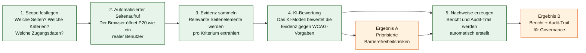

# Managementübersicht — a11y-llm

**Projekt:** a11y-llm · **Version:** 0.1.0  
**Adressaten:** Management, Projektverantwortliche, Fachbereich

Diese Übersicht gibt einen kompakten, ehrlichen Einblick in Zweck, Nutzen,
Umfang und Reifegrad des Projekts. Technische Details finden Entwickler im
[Entwicklerhandbuch](ENTWICKLERHANDBUCH.md).

---

## 1. Auf einen Blick

`a11y-llm` ist ein automatisiertes Prüfwerkzeug für digitale Barrierefreiheit.
Es prüft die P20-Anwendung auf Einhaltung der gesetzlich und normativ
relevanten WCAG-Richtlinien (Web Content Accessibility Guidelines) und erzeugt
revisionsfähige Testnachweise.

**Was es kann:**

- Seiten der P20-Anwendung automatisiert aufrufen und auf Barrierefreiheit prüfen.
- WCAG-Kriterien mithilfe eines KI-Modells qualitativ bewerten.
- Prüfergebnisse als strukturierte Berichte (Allure-Reports) und Logs dokumentieren.
- Prüfläufe reproduzierbar und nachvollziehbar gestalten.

**Was es aktuell noch nicht kann:**

- Vollständige WCAG-Abdeckung aller Kriterien (derzeit vier Kriterien aktiv).
- Vollautomatisierten Dauerbetrieb ohne manuelle Auslösung (CI/CD-Integration in Vorbereitung).

---

## 2. Warum dieses Projekt?

Digitale Barrierefreiheit ist für öffentliche und unternehmensinterne
Anwendungen eine gesetzliche Anforderung (BITV 2.0, EU Web Accessibility
Directive). Manuelle Prüfungen sind zeitaufwendig, nicht reproduzierbar und
teuer zu skalieren.

`a11y-llm` schließt diese Lücke: Es automatisiert die Prüfung, macht
Ergebnisse nachvollziehbar und reduziert den manuellen Aufwand — ohne auf
qualitative Bewertung durch KI zu verzichten.

**Erwarteter Nutzen:**

| Nutzen | Beschreibung |
| --- | --- |
| Frühzeitige Fehlererkennung | Barrierefreiheitsprobleme werden bereits in der Entwicklung sichtbar, nicht erst beim Audit |
| Verkürzte Testzyklen | Automatisierte Läufe ersetzen zeitaufwendige manuelle Sichtprüfungen |
| Revisionsfähige Nachweise | Jedes Prüfergebnis ist mit Evidenz und Zeitstempel dokumentiert |
| Bessere Priorisierung | Strukturierte Ergebnisse erlauben gezielte Korrekturmaßnahmen |

---

## 3. Wie funktioniert es? (nicht-technisch)

Der Prüfprozess läuft in fünf Schritten ab:

**Lesehilfe:** Grüne Boxen sind Prozessschritte; orange Boxen sind die
geschäftlich relevanten Ergebnisse. Der Prüflauf endet immer mit einem
klaren BESTANDEN / NICHT BESTANDEN und vollständiger Nachweislage.

---

## 4. Was wird geprüft?

Aktuell sind vier WCAG-Kriterien aktiv konfiguriert:

| Kriterium | Bezeichnung | Stufe | Bedeutung |
| --- | --- | --- | --- |
| 2.4.4 | Linkzweck (im Kontext) | A | Links müssen ihren Zweck im Kontext erkennbar machen |
| 2.4.9 | Linkzweck (nur Link) | AAA | Links müssen ihren Zweck allein aus dem Linktext erkennbar machen |
| 3.1.1 | Sprache der Seite | A | Die Hauptsprache der Seite muss im Code angegeben sein |
| 3.1.2 | Sprache von Teilen | AA | Fremdsprachige Abschnitte müssen separat ausgezeichnet sein |

Die Liste ist erweiterbar — neue Kriterien werden per Konfigurationsdatei
ohne Codeänderungen ergänzt.

---

## 5. Nachweisführung und Auditierbarkeit

Jeder Prüflauf erzeugt automatisch:

- **Allure-Report:** visueller Bericht mit Testergebnissen, per-Element-Evidenz
  und Screenshots.
- **Strukturierte Logs:** maschinenlesbare JSON-Logs mit Zeitstempel,
  Korrelations-ID und Modulkontext — für jede Frage nachvollziehbar.
- **Audit-Trail:** Jedes Element, das eine KI-Bewertung erhalten hat, ist
  namentlich dokumentiert inklusive Status (BESTANDEN / FEHLGESCHLAGEN /
  MANUELL PRÜFEN).

---

## 6. Risiken und Gegenmaßnahmen

| Risiko | Einordnung | Gegenmaßnahme |
| --- | --- | --- |
| Geringe Kriterienabdeckung | Fachlich | Kriterienkatalog schrittweise auf A/AA ausbauen |
| Keine formale CI/CD-Strecke | Betrieb | CI/CD mit Qualitäts-Gates einrichten |
| Sensible Daten an KI-Modell | Compliance | Datenminimierung aktiv; LLM-Endpoint prüfen |
| Manuelle Auslösung erforderlich | Betrieb | Automatisierte Ausführung per CI/CD geplant |

---

## 7. Projektreifegrad

| Dimension | Reifegrad | Bewertung |
| --- | --- | --- |
| Technisch | Fortgeschritten | Vollständige Architektur, typisierte Schnittstellen, robuste Fehlerbehandlung |
| Fachlich | Initial | Vier Kriterien aktiv, Erweiterung geplant |
| Betrieb | Vorbereitend | Kein CI/CD, manuelle Ausführung; Prozesse noch zu formalisieren |

**Fazit:** Das Projekt hat ein belastbares technisches Fundament. Der nächste
logische Schritt ist keine Neuentwicklung, sondern die strukturierte Skalierung
entlang fachlicher Abdeckung und Betriebsreife.

---

## 8. Empfohlene Rollen

| Rolle | Aufgabe |
| --- | --- |
| Fach-/Produktverantwortung | WCAG-Kriterien priorisieren, Abnahmekriterien definieren |
| Technische Leitung | Architekturentscheidungen, Sicherheit, Integrationsqualität |
| QA / Testmanagement | Testabdeckung, Regression, Evidenzqualität bewerten |
| Betrieb / DevOps | CI/CD einrichten, Logs und Artefakte verwalten |

---

## 9. Roadmap

1. **Fachliche Skalierung** — Erweiterung auf weitere WCAG-Kriterien der
   Stufen A und AA.
2. **CI/CD-Integration** — Automatisierte Ausführung mit Qualitäts-Gates
   (Lint, Typprüfung, Tests, Reportgenerierung).
3. **Betriebshärtung** — Zentrales Secret-Management, definierte
   Aufbewahrungsfristen für Logs und Testartefakte, dokumentierte LLM-Endpoint-Prüfung.
4. **Axe-Audit-Integration** — Klassische regelbasierte Prüfung als
   Ergänzung zur KI-Bewertung aktivieren.

---

## 10. Empfehlungen für den produktiven Einsatz

- Secrets (LLM-API-Schlüssel, P20-Zugangsdaten) ausschließlich über einen
  zentralen Secret-Store verwalten — keine Klartext-Schlüssel in Dateien.
- Nachvollziehbare Aufbewahrungsfristen für Logs und Testartefakte definieren.
- Den LLM-Endpoint vor dem Verarbeiten potenziell sensibler Inhalte auf
  Datenschutzkonformität und Datenresidenz prüfen.
- Reproduzierbare CI/CD-Strecke mit Qualitäts-Gates einrichten.
