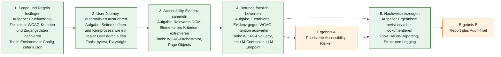
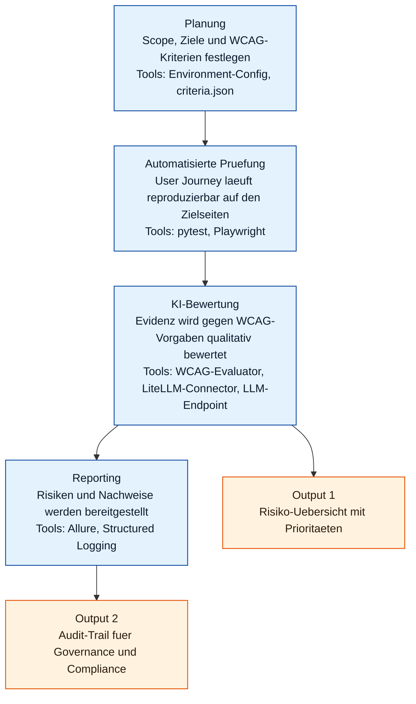

# Management-Dokumentation

**Projekt:** a11y-llm · **Version:** 0.1.0 · **Adressaten:** Fach- und
Projektverantwortliche, QA, Betrieb

Diese Dokumentation gibt einen kompakten, ehrlichen Überblick über Zweck,
Nutzen, Umfang und Reifegrad des Projekts. Die technische Tiefe steht in
[TECHNICAL_DOCUMENTATION.md](TECHNICAL_DOCUMENTATION.md) (Englisch), die
Architekturdiagramme in [ARCHITECTURE.md](ARCHITECTURE.md) (Englisch).

## 1. Management Summary

`a11y-llm` ist ein automatisierter Prüfrahmen für digitale
Barrierefreiheit. Er verbindet Browser-Automatisierung mit KI-gestützter
WCAG-Auswertung und erzeugt nachvollziehbare Testnachweise in Form von
strukturierten Logs und Allure-Reports.

Der derzeitige Reifegrad entspricht einem belastbaren technischen Fundament mit
sauberer, erweiterbarer Architektur:

- Vollständige Test-Orchestrierung (Playwright + pytest + Allure).
- Strikte KI-Antwortvalidierung (Schema, Fehlerbehandlung, Reconciliation).
- Nachvollziehbarkeit über Correlation-IDs und Evidenz-Artefakte.
- Vier fachliche Regeln aktiv (WCAG 2.4.4, 2.4.9, 3.1.1, 3.1.2).

Die nächsten Ausbaustufen sind klar ableitbar: fachliche Skalierung auf weitere
WCAG-Kriterien, Fertigstellung der klassischen Axe-Audit-Integration und – für
einen produktiven Dauerbetrieb – die Härtung von Sicherheits- und
Betriebsprozessen.

## 2. Zielbild und Nutzen

**Zielbild:** ein einheitliches, wiederholbares und revisionsfähiges Verfahren
zur Accessibility-Prüfung digitaler Oberflächen, das regelbasierte Extraktion
mit KI-Bewertung kombiniert.

**Erwarteter Nutzen:**

- Früheres Erkennen von Accessibility-Mängeln.
- Verkürzte Testzyklen durch Automatisierung.
- Transparente, nachvollziehbare Testnachweise für interne und externe
  Prüfinstanzen.
- Bessere Priorisierung von Korrekturmaßnahmen durch strukturierte
  Ergebnisdaten.

## 3. Leistungsumfang

**In Scope (aktuell):**

- Browserbasierter End-to-End-Testlauf.
- Extraktion von Ziel-Elementen über konfigurierbare Selektoren.
- KI-basierte Bewertung gegen hinterlegte WCAG-Regelbeschreibungen.
- Ergebnisaggregation je Element mit Allure-Dokumentation.
- Logging mit Korrelation je Testfall.

**Out of Scope (aktuell):**

- Vollständiger WCAG-Deckungsgrad.
- Vollintegrierte Axe-Auswertung (derzeit Platzhalter).
- Produktiver Multi-Umgebungsbetrieb mit formalisierter CI/CD-Strecke.

## 4. Ablauf und Tooling (Management-Sicht)

Das folgende Diagramm zeigt pro Schritt, was getan wird und welche
Werkzeuge/Bibliotheken eingesetzt werden.

**Lesehilfe:** Grüne Boxen sind Prozessschritte inklusive Aufgabe und
eingesetzter Werkzeuge; orange Boxen sind die geschäftlich relevanten
Ergebnisse. Der Fluss verläuft von links nach rechts: Planung, Ausführung,
Bewertung, Reporting.

### Eine Folie für die Kurzübersicht

## 5. Operativer Ablauf (End-to-End)

1. Der Testlauf startet per `pytest`.
2. Logging und Allure werden zentral initialisiert.
3. Eine Browser-Instanz wird gestartet, je Test entsteht ein isolierter
   Kontext.
4. Die Zielseite wird aufgerufen und auf Bereitschaft geprüft.
5. Relevante DOM-Elemente werden gemäß Regelkonfiguration extrahiert.
6. Die Elemente werden in Batches an das KI-Modell übergeben.
7. KI-Antworten werden strikt geparst und validiert.
8. Abweichungen (fehlende/duplizierte IDs) werden automatisch markiert und
   ergänzt.
9. Ergebnisse und Evidenzen werden in Allure angehängt.
10. Der Test erhält PASS/FAIL mit vollständiger Nachweislage.

## 6. Nachweisführung und Auditierbarkeit

- **Nachweisartefakte:** Allure-Steps und -Attachments auf Test- und
  Elementebene, JSON-Struktur der KI-Ergebnisse, Fehlersammlung bei
  Regelverstößen, Vollseiten-Screenshot.
- **Logische Nachvollziehbarkeit:** einheitliche Correlation-ID pro Testfall;
  strukturierte Logs (JSON oder Text) mit Zeitstempel, Modul, Funktion und
  Zeile.
- **Reproduzierbarkeit:** deterministischer Fixture-Lifecycle mit
  kontrollierter Ressourcenschließung.

## 7. Risikobild und Gegenmaßnahmen

| Risiko | Einordnung | Gegenmaßnahme |
| --- | --- | --- |
| Geringe Kriterienabdeckung | Fachlich | Kriterienkatalog (A/AA priorisiert) ausbauen |
| Axe-Audit als Platzhalter | Technisch | Klassische Axe-Integration fertigstellen |
| Keine formale CI/CD-Strecke | Betrieb | CI/CD mit Qualitäts-Gates (Lint/Type/Test/Report) |
| Sensible Inhaltsdaten bei KI-Aufrufen | Compliance | Datenminimierung vor Übergabe; Prüfung des LLM-Endpoints |

## 8. Reifegrad

- **Technischer Reifegrad:** fortgeschrittenes, sauber strukturiertes Fundament
  (pre-production-fähige Basis). Klare Modulgrenzen, typisierte Schnittstellen,
  robuste Fehlerbehandlung.
- **Fachlicher Reifegrad:** initial und ausbaufähig (vier Kriterien aktiv).
- **Betriebsreife:** vorbereitend; Betriebs- und Governance-Prozesse sind für
  einen produktiven Dauerbetrieb noch zu formalisieren.

## 9. Rollen (empfohlen)

- **Fach-/Produktverantwortung:** Priorisierung der WCAG-Kriterien,
  Abnahmekriterien.
- **Technische Leitung:** Architekturentscheidungen, Integrationsqualität,
  Security by design.
- **QA/Testmanagement:** Testabdeckung, Regression, Evidenzqualität.
- **Betrieb/DevOps:** CI/CD, Laufzeitstabilität, Artefakt- und Log-Management.

## 10. Ausbaustufen

1. **Fachliche Skalierung** – Erweiterung auf weitere WCAG-Kriterien mit
   einheitlicher Prompt-/Auswertestrategie.
2. **Klassische Pipeline** – Fertigstellung der Axe-Audit-Integration, sichtbar
   in den Reports.
3. **Qualitäts- und Betriebshärtung** – CI/CD mit Qualitäts-Gates,
   Datenminimierung, definierte Aufbewahrungs- und Löschkonzepte für Artefakte.

## 11. Empfehlungen für den produktiven Einsatz

- Verbindliches Secret-Management ohne Klartextschlüssel in Dateien
  (zentraler Secret-Store mit Rotation).
- Nachvollziehbare Retention für Logs und Testartefakte.
- Datenminimierung und dokumentierte Prüfung des LLM-Endpoints vor dem
  Verarbeiten potenziell sensibler Inhalte.
- Reproduzierbare CI/CD-Strecke mit Qualitäts-Gates.

## 12. Fazit

a11y-llm besitzt eine belastbare technische Grundarchitektur mit hoher
Transparenz und guter Erweiterbarkeit. Der nächste logische Schritt ist kein
Neubau, sondern die strukturierte Skalierung des vorhandenen Fundaments entlang
fachlicher Abdeckung, Betriebsreife und – falls für den Einsatzkontext
erforderlich – Governance-Anforderungen.
